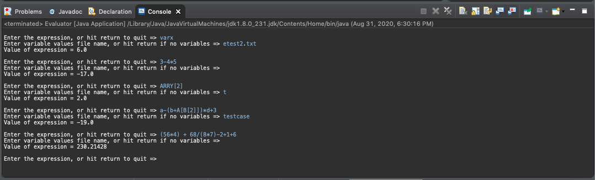

# Expression Calculator
Expression Calculator created as a part of Data Structures class. The calculator can calculate any expression entered into the console using multiplication, division, addition, and subtraction as operators. The calculator can also accept variables and arrays of numbers from a file containing them. Check out the PDF titled "CS112 Spring 2020_ Expression Evaluation.pdf" to learn more about how to enter and use variables/arrays. 
 
To use the calculator, clone the project and open it with your favorite Java IDE (I personally use Eclipse). Run the project, and you'll be able to use the calculator in your console.
 
For now, here are some examples of the calculator at work:

